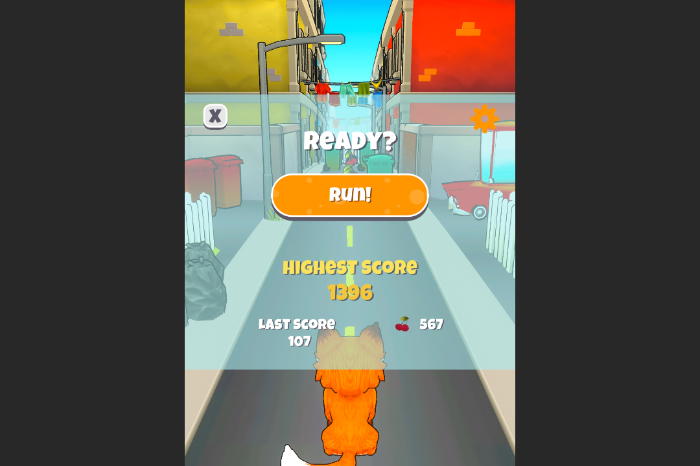

# Endless Runner Game (GameDevPro)

Mobile game created in Unity as part of a GameDevPro project to apply learning basic concepts of Unity and programming with C#.

### Implementation

Player moves on the left, right and center layers. With increased travel speed in forward movement over time. The objective is to collect itens and avoid obstacles. It was implementing only the keyboard input system and not touch (Tests only on PC).

### Links
Video - https://drive.google.com/file/d/1OsbETgtGC6HisHAY2HeQ_FqZFPNx5KKd/view?usp=sharing
